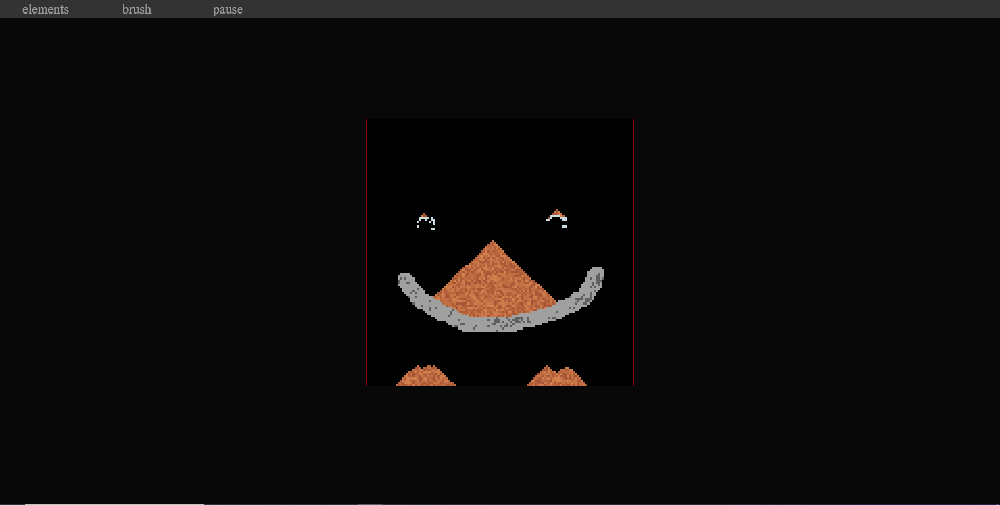

SandAndSoil is my attempt to implement mechanics of "Falling sand game".

Level up system has been added to extend the fun of the game.
You get experience for the level when two elements are combined into one or more new elements.
As you level up, you get the ability to create new items.
Your level is stored in local storage, but experience is not.

